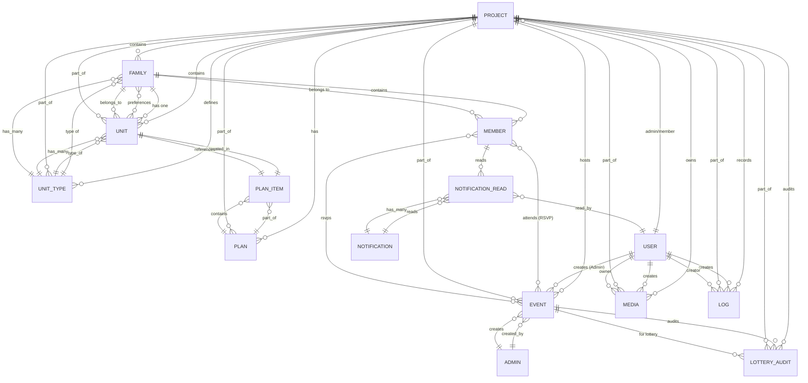

<!-- Copilot - Pending review -->

# MTAV Database Entity-Relationship Diagram

This document provides a comprehensive Entity-Relationship (ER) diagram for the MTAV project database models.

## Overview

The MTAV system is organized around the core concept of **Projects**, which contain organizational structures like families, units, and users. The diagram below shows the relationships between all major entities.

## ER Diagram

## Entity Descriptions

### Core Entities

#### **PROJECT**
The main organizational unit. Contains all other entities scoped to a specific project.
- `id` - Primary key
- `name` - Project name
- `description` - Project description
- Multiple soft deletes and timestamps

**Key Relationships:**
- Has many Families, Units, UnitTypes, Plans, Events, Media, Logs, LotteryAudits
- Many-to-many with Users (Admins/Members) through project_user pivot table

#### **USER** (Base class)
Base user entity with inheritance for Admin and Member subclasses.
- `id` - Primary key
- `email` - Email address
- `password` - Hashed password
- `firstname`, `lastname` - User name
- `is_admin` - Boolean flag distinguishing Admin from Member
- Soft deletes, timestamps

**Subclasses:**
- **ADMIN** - Users with `is_admin = true`
- **MEMBER** - Users with `is_admin = false`

#### **FAMILY**
Represents a family unit within a project.
- `id` - Primary key
- `name` - Family name
- `project_id` - Foreign key to Project
- `unit_type_id` - Foreign key to UnitType
- Soft deletes, timestamps

**Key Relationships:**
- Belongs to Project and UnitType
- Has many Members
- Has one Unit (the unit assigned to this family)
- Many-to-many with Units for preferences (unit_preferences pivot table)

#### **MEMBER** (Extends User)
A user type representing family members within projects.
- Inherits all User attributes
- Additional relationships specific to member functionality
- Each member may belong to one family and have project affiliation

**Key Relationships:**
- Belongs to Family
- Many-to-many with Events through event_rsvp (for RSVP tracking)
- Many-to-many with Projects through project_user (with active status)

#### **ADMIN** (Extends User)
A user type with administrative privileges.
- Inherits all User attributes
- Can create Events
- Can manage Projects

**Key Relationships:**
- Has many Events (as creator)
- Many-to-many with Projects through project_user

#### **UNIT**
Represents a physical unit (apartment, room, etc.) in the project.
- `id` - Primary key
- `identifier` - Unique identifier (e.g., "A-101")
- `project_id` - Foreign key to Project
- `unit_type_id` - Foreign key to UnitType
- `family_id` - Foreign key to Family (which family occupies this unit)
- `plan_item_id` - Foreign key to PlanItem (location on plan)
- Soft deletes, timestamps

**Key Relationships:**
- Belongs to Project, UnitType, Family, PlanItem
- Referenced by Family preferences through unit_preferences pivot table

#### **UNIT_TYPE**
Classification for units (e.g., "1-Bedroom", "2-Bedroom", "Penthouse").
- `id` - Primary key
- `name` - Type name
- `description` - Type description
- `project_id` - Foreign key to Project
- Soft deletes, timestamps

**Key Relationships:**
- Belongs to Project
- Has many Units
- Has many Families

### Planning Entities

#### **PLAN**
Represents a floor plan or layout for the project.
- `id` - Primary key
- `project_id` - Foreign key to Project
- `polygon` - JSON array of polygon coordinates
- `width`, `height` - Dimensions
- Timestamps

**Key Relationships:**
- Belongs to Project
- Has many PlanItems
- Has many Units (through PlanItems)

#### **PLAN_ITEM**
Individual unit placement on a plan.
- `id` - Primary key
- `plan_id` - Foreign key to Plan
- `unit_id` - Foreign key to Unit
- `polygon` - JSON array of coordinates on plan
- `metadata` - JSON metadata
- `floor` - Floor number
- Timestamps

**Key Relationships:**
- Belongs to Plan
- Has one Unit

### Event & Lottery Entities

#### **EVENT**
Represents events (activities, lotteries) within a project.
- `id` - Primary key
- `project_id` - Foreign key to Project
- `creator_id` - Foreign key to Admin (who created the event)
- `title`, `description` - Event details
- `type` - EventType enum (e.g., 'lottery', 'activity')
- `start_date`, `end_date` - Event timing
- `is_published` - Publication status
- `rsvp` - Whether RSVP is enabled
- Soft deletes, timestamps

**Key Relationships:**
- Belongs to Project and Admin (creator)
- Many-to-many with Members through event_rsvp pivot table (for RSVP tracking)
- Has many LotteryAudits (for lottery events)

#### **LOTTERY_AUDIT**
Audit trail for lottery event execution.
- `id` - Primary key
- `project_id` - Foreign key to Project
- `lottery_id` - Foreign key to Event (the lottery)
- `type` - LotteryAuditType enum
- `audit` - JSON audit data
- Soft deletes, timestamps

**Key Relationships:**
- Belongs to Project and Event (lottery)

### Media & Logging Entities

#### **MEDIA**
File uploads and media assets.
- `id` - Primary key
- `project_id` - Foreign key to Project
- `owner_id` - Foreign key to User (who uploaded)
- `filename`, `path` - File information
- `category` - MediaCategory enum
- `width`, `height`, `file_size` - Media properties
- Soft deletes, timestamps

**Key Relationships:**
- Belongs to Project and User (owner)
- Related to Member through Family (hasManyThrough)

#### **LOG**
System logs and event records.
- `id` - Primary key
- `project_id` - Foreign key to Project
- `creator_id` - Foreign key to User
- `event` - Log event description
- `data` - JSON data
- Timestamps

**Key Relationships:**
- Belongs to Project and User (creator)

### Notification Entities

#### **NOTIFICATION**
System notifications for users.
- `id` - Primary key
- `title` - Notification title
- `message` - Notification message
- `type` - NotificationType enum
- `target` - NotificationTarget enum
- `target_id` - ID of the target (project, family, etc.)
- `data` - JSON additional data
- Timestamps

**Key Relationships:**
- Many-to-many with Users through notification_read pivot table

#### **NOTIFICATION_READ**
Pivot table tracking which users have read notifications.
- `user_id` - Foreign key to User
- `notification_id` - Foreign key to Notification
- `read_at` - When the notification was read
- Timestamps

## Key Design Patterns

### Single Table Inheritance
The `User` model uses single table inheritance with the `is_admin` flag:
- **Admin**: `is_admin = true`
- **Member**: `is_admin = false`

### Polymorphic-like Media
Media can be owned by any User and is associated with a Project.

### Preference System
Families maintain unit preferences through a many-to-many relationship (`unit_preferences` pivot table) with an `order` column to maintain preference ordering.

### Event RSVP Tracking
Event attendance is tracked through the `event_rsvp` pivot table with a `status` field:
- `null` - Not yet responded
- `true` - Accepted
- `false` - Declined

### Project Scoping
Most entities are scoped to a Project through the ProjectScope concern, ensuring data isolation between projects.

### Soft Deletes
Most entities use soft deletes, allowing for data recovery while logically removing records.

## Cardinality Legend

- `||` - One to one (required)
- `o|` - Zero or one
- `o{` - Zero or many
- `||{}` - One or many

