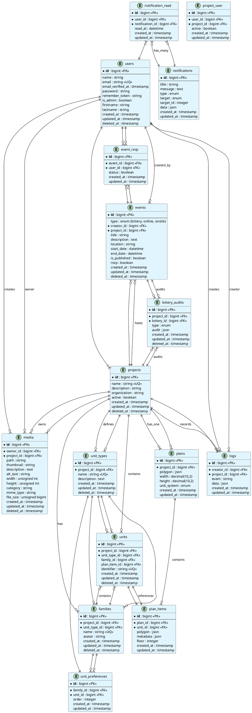

<!-- Copilot - Pending review -->

```plantuml
@startuml MTAV_Database_Schema

!define TABNAME_BGCOLOR #E1F5FE
!define FIELDS_BGCOLOR #FFFFFF

skinparam backgroundColor white
skinparam classBackgroundColor TABNAME_BGCOLOR
skinparam classArrowColor black

entity "users" as users {
  * **id** : bigint <<PK>>
  --
  name : string
  email : string <<UQ>>
  email_verified_at : timestamp
  password : string
  remember_token : string
  is_admin : boolean
  firstname : string
  lastname : string
  created_at : timestamp
  updated_at : timestamp
  deleted_at : timestamp
}

entity "projects" as projects {
  * **id** : bigint <<PK>>
  --
  name : string <<UQ>>
  description : string
  organization : string
  active : boolean
  created_at : timestamp
  updated_at : timestamp
  deleted_at : timestamp
}

entity "project_user" as project_user {
  * **id** : bigint <<PK>>
  --
  * user_id : bigint <<FK>>
  * project_id : bigint <<FK>>
  active : boolean
  created_at : timestamp
  updated_at : timestamp
}

entity "unit_types" as unit_types {
  * **id** : bigint <<PK>>
  --
  * project_id : bigint <<FK>>
  name : string <<UQ>>
  description : text
  created_at : timestamp
  updated_at : timestamp
  deleted_at : timestamp
}

entity "families" as families {
  * **id** : bigint <<PK>>
  --
  * project_id : bigint <<FK>>
  * unit_type_id : bigint <<FK>>
  name : string <<UQ>>
  avatar : string
  created_at : timestamp
  updated_at : timestamp
  deleted_at : timestamp
}

entity "units" as units {
  * **id** : bigint <<PK>>
  --
  * project_id : bigint <<FK>>
  * unit_type_id : bigint <<FK>>
  family_id : bigint <<FK>>
  plan_item_id : bigint <<FK>>
  identifier : string <<UQ>>
  created_at : timestamp
  updated_at : timestamp
  deleted_at : timestamp
}

entity "unit_preferences" as unit_preferences {
  * **id** : bigint <<PK>>
  --
  * family_id : bigint <<FK>>
  * unit_id : bigint <<FK>>
  order : integer
  created_at : timestamp
  updated_at : timestamp
}

entity "plans" as plans {
  * **id** : bigint <<PK>>
  --
  * project_id : bigint <<FK>>
  polygon : json
  width : decimal(10,2)
  height : decimal(10,2)
  unit_system : enum
  created_at : timestamp
  updated_at : timestamp
}

entity "plan_items" as plan_items {
  * **id** : bigint <<PK>>
  --
  * plan_id : bigint <<FK>>
  * unit_id : bigint <<FK>>
  polygon : json
  metadata : json
  floor : integer
  created_at : timestamp
  updated_at : timestamp
}

entity "events" as events {
  * **id** : bigint <<PK>>
  --
  type : enum (lottery, online, onsite)
  * creator_id : bigint <<FK>>
  * project_id : bigint <<FK>>
  title : string
  description : text
  location : string
  start_date : datetime
  end_date : datetime
  is_published : boolean
  rsvp : boolean
  created_at : timestamp
  updated_at : timestamp
  deleted_at : timestamp
}

entity "event_rsvp" as event_rsvp {
  * **id** : bigint <<PK>>
  --
  * event_id : bigint <<FK>>
  * user_id : bigint <<FK>>
  status : boolean
  created_at : timestamp
  updated_at : timestamp
}

entity "media" as media {
  * **id** : bigint <<PK>>
  --
  * owner_id : bigint <<FK>>
  * project_id : bigint <<FK>>
  path : string
  thumbnail : string
  description : text
  alt_text : string
  width : unsigned int
  height : unsigned int
  category : string
  mime_type : string
  file_size : unsigned bigint
  created_at : timestamp
  updated_at : timestamp
  deleted_at : timestamp
}

entity "logs" as logs {
  * **id** : bigint <<PK>>
  --
  * creator_id : bigint <<FK>>
  * project_id : bigint <<FK>>
  event : string
  data : json
  created_at : timestamp
  updated_at : timestamp
}

entity "lottery_audits" as lottery_audits {
  * **id** : bigint <<PK>>
  --
  * project_id : bigint <<FK>>
  * lottery_id : bigint <<FK>>
  type : enum
  audit : json
  created_at : timestamp
  updated_at : timestamp
  deleted_at : timestamp
}

entity "notifications" as notifications {
  * **id** : bigint <<PK>>
  --
  title : string
  message : text
  type : enum
  target : enum
  target_id : integer
  data : json
  created_at : timestamp
  updated_at : timestamp
}

entity "notification_read" as notification_read {
  * **id** : bigint <<PK>>
  --
  * user_id : bigint <<FK>>
  * notification_id : bigint <<FK>>
  read_at : datetime
  created_at : timestamp
  updated_at : timestamp
}

' Relationships
projects ||--o{ families : has
projects ||--o{ unit_types : defines
projects ||--o{ units : contains
projects ||--o{ plans : has_one
projects ||--o{ events : hosts
projects ||--o{ media : owns
projects ||--o{ logs : records
projects ||--o{ lottery_audits : audits
projects }o--|| users : ""
users ||--o{ media : creates
users ||--o{ logs : creates
users ||--o{ event_rsvp : ""

families ||--o{ units : contains
families }o--|| unit_types : ""
families ||--o{ unit_preferences : ""

units }o--|| families : ""
units }o--|| unit_types : ""
units ||--|| plan_items : ""

unit_types }o--|| projects : ""
unit_types ||--o{ units : ""
unit_types ||--o{ families : ""

unit_preferences ||--|| unit_types : ""
unit_preferences }o--|| families : ""

plans }o--|| projects : ""
plans ||--o{ plan_items : contains

plan_items ||--|| units : references

events }o--|| projects : ""
events }o--|| users : created_by
events ||--o{ event_rsvp : ""
events ||--o{ lottery_audits : audits

event_rsvp }o--|| events : ""
event_rsvp }o--|| users : ""

media }o--|| projects : ""
media }o--|| users : owner

logs }o--|| projects : ""
logs }o--|| users : creator

lottery_audits }o--|| projects : ""
lottery_audits }o--|| events : ""

notifications ||--o{ notification_read : has_many

notification_read }o--|| users : ""
notification_read }o--|| notifications : ""

@enduml
```

This is a detailed database schema diagram showing all tables with their columns and types. To render this as an image, you can use any PlantUML renderer.
