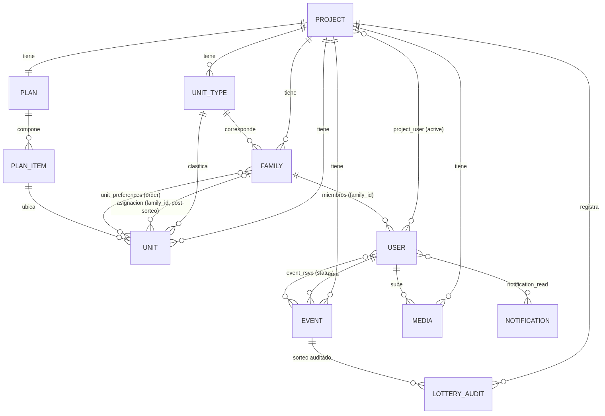
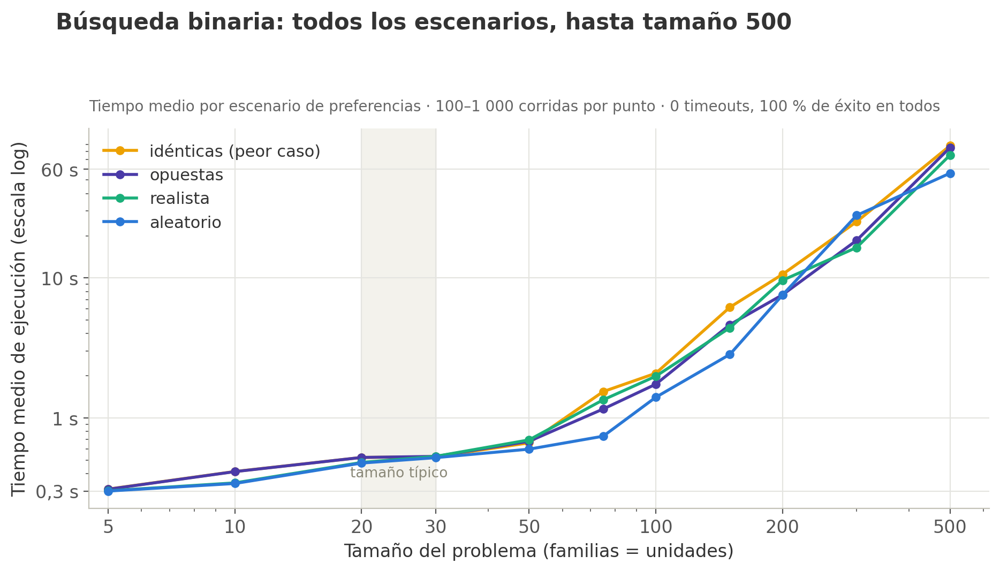
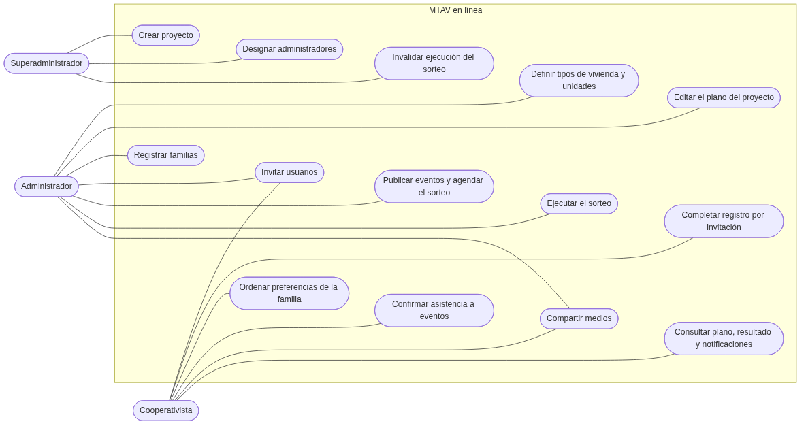
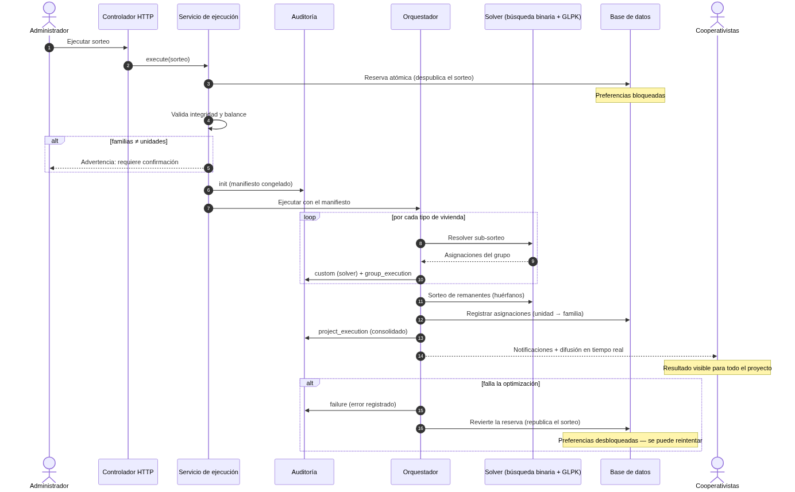

```{=openxml}
<w:p><w:r><w:br w:type="page"/></w:r></w:p>
```

# Apéndices

Los apéndices son material de referencia. No están pensados para leerse de principio a fin: cada uno amplía un tema que las Partes I a IV presentan de forma suficiente para comprender el trabajo. Un lector con interés particular en un tema —el modelo de datos, la formulación matemática, la planificación— encontrará aquí el detalle; quien no, puede omitirlos sin perder el hilo.

**Guía rápida:**

- **A — Modelo de datos y recursos JSON.** Por qué el esquema tiene la forma que tiene (derivación), diagrama entidad-relación completo y definiciones tabla por tabla, y el glosario de los recursos JSON que exponen esos modelos al frontend.
- **B — Autenticación, roles y permisos.** Mecanismo de autenticación y flujo de invitación y registro; matriz de qué puede hacer cada rol, por recurso y acción.
- **C — El sorteo: modelos, auditoría y rendimiento.** Modelos GMPL completos de la formulación de la Parte III, formato del registro de auditoría de cada ejecución, y los datos completos de los *benchmarks* de rendimiento.
- **D — Formato de datos del plano espacial** y arquitectura de sus componentes.
- **E — Testing y aseguramiento de calidad.**
- **F — Uso de IA en el proyecto.**
- **G — Análisis: casos de uso, requisitos y flujos.** Actores, casos de uso, requisitos funcionales y no funcionales, y el diagrama de secuencia del sorteo.
- **H — Manuales de usuario.** Las guías por rol tal como las ve el usuario en la aplicación.
- **I — Herramientas de desarrollo y entornos (DX).** El comando `./mtav` y la composición de entornos Docker que abstraen la complejidad operativa para quien retome el proyecto.

---

## Apéndice A — Modelo de datos y recursos JSON

### A.1 Del problema al esquema: por qué el modelo crece

La premisa de MTAV en línea es engañosamente simple: *"hagamos una aplicación para que las propias familias ingresen sus preferencias y se ejecute el sorteo"*. A primera vista no parece necesitar mucho más que una lista de familias y una lista de viviendas. Sin embargo, el modelo de datos real tiene más de una docena de tablas. Esta sección deriva ese modelo paso a paso, mostrando cómo **cada entidad aparece obligada por una necesidad concreta**. Es el lugar donde vive, de forma cohesiva, la justificación completa del modelo; el resto del documento se apoya en esta derivación en lugar de repetirla.

**Punto de partida: preferencias.** El sorteo asigna viviendas a partir de las preferencias. Lo mínimo indispensable es, entonces, tres cosas: una **familia**, un conjunto de **unidades** (las viviendas concretas) y una forma de registrar cómo esa familia *ordena* esas unidades. Ese ordenamiento es una relación muchos-a-muchos entre familias y unidades con un dato extra —la posición en el ranking—, que en el esquema es la tabla `unit_preferences` con su columna `order`. Nótese ya una decisión de fondo: **la unidad que recibe una vivienda es la familia, no la persona**. Una familia obtiene exactamente una unidad.

**Una familia es varias personas: los miembros.** Una familia no es un único usuario: varias personas —integrantes de un mismo núcleo— pueden interactuar con la aplicación en su nombre. Necesitamos entonces **miembros** (`Member`; son los *cooperativistas* de las Partes I y II — aquí se usa el nombre que llevan en el modelo), cada uno perteneciente a una familia (`family_id`). Una familia tiene muchos miembros; un miembro pertenece a una familia. Las preferencias, sin embargo, siguen siendo de la *familia*, no de cada miembro: cualquier integrante las edita, pero el sujeto del sorteo es el núcleo familiar.

**Todos se autentican: la tabla `users`.** Los miembros inician sesión. Pero también lo hacen quienes configuran el proyecto (los administradores) y quienes operan la plataforma (los superadministradores). Todos comparten exactamente el mismo mecanismo de autenticación: correo y contraseña, invitaciones (salvo superadministradores), restablecimiento de clave. En lugar de tres tablas de autenticación paralelas, se unifican en una sola tabla **`users`**, y el tipo se distingue con un flag `is_admin`; los miembros, además, llevan su `family_id`. El superadministrador es un usuario administrador (a nivel de la base de datos) cuyo correo figura en una lista de configuración del entorno. (El detalle de esta "pseudo-herencia de tabla única" y sus alternativas se trata más abajo, en A.3.)

**Todo pertenece a una cooperativa: los proyectos.** MTAV en línea sirve a muchas cooperativas a la vez. Cada familia, cada unidad, cada evento pertenece a un **proyecto** concreto (el emprendimiento de una cooperativa). Aparece así la entidad `Project`, y las familias y unidades pasan a pertenecer a un proyecto. Esta pertenencia no es solo organizativa: es la que permite que la aplicación aísle por completo los datos de una cooperativa de los de otra (el mecanismo de *scoping* por proyecto se detalla en la Sección 20).

**Alguien crea y gestiona todo esto: los administradores.** Las familias, las unidades y los eventos no se crean solos. Hace falta un **administrador** (`Admin`) que configure el proyecto. Los administradores se relacionan con los proyectos, y como un administrador puede gestionar varios proyectos y un proyecto puede tener varios administradores, esa relación es muchos-a-muchos, a través de la tabla `project_user` (con un campo `active`). Los miembros se vinculan a su proyecto por esa misma tabla —normalmente a un único proyecto activo—, lo que mantiene una sola vía de pertenencia usuario–proyecto.

**Las unidades no son intercambiables: los tipos de unidad.** Un apartamento de dos dormitorios y uno de tres no son comparables, y una familia a la que le corresponde uno de tres dormitorios solo debe seleccionar sus preferencias por unidades de tres dormitorios. Por eso cada unidad tiene un **tipo** (`UnitType`) y cada familia tiene asignado un tipo. Esto revela algo importante sobre el sorteo: el sorteo "global" de un proyecto es en realidad un conjunto de **sub-sorteos independientes, uno por tipo de unidad**, en los que las familias de ese tipo compiten por las unidades de ese tipo. El tipo de unidad no es un adorno descriptivo: es lo que particiona el problema. (La mecánica del sorteo por tipos y la redistribución de remanentes se tratan en la Sección 16.)

**El resultado: la asignación.** Terminado el sorteo, cada familia recibe exactamente una unidad. Eso se registra en la propia unidad, mediante su `family_id`: una unidad pertenece (tras el sorteo) a una familia, y una familia tiene una unidad. Antes del sorteo ese vínculo es nulo. La asignación no es una tabla aparte: es este vínculo el que constituye la fuente de verdad del resultado.

**Y sigue creciendo.** Sobre esta espina dorsal —familias, miembros, usuarios, proyectos, administradores, tipos de unidad, unidades y preferencias— se apoyan las demás piezas, cada una respondiendo a una necesidad igual de concreta: los **eventos** y su confirmación de asistencia (asambleas, el propio sorteo), los **medios** (documentos e imágenes del proyecto), el **plano** espacial, las **notificaciones** y el **registro de auditoría** del sorteo. Cada una se describe en su sección correspondiente.

Dos observaciones cierran la derivación:

- **Las preferencias son dinámicas.** El modelo permite que las unidades se agreguen o quiten y que las familias cambien de tipo. Por eso la tabla `unit_preferences` **no** es la fuente de verdad de las preferencias: la lista válida de preferencias de cada familia se resuelve en tiempo de ejecución, contemplando esos cambios (se detalla en la Sección 16). Esta flexibilidad es, ella misma, una consecuencia de haber modelado el problema con entidades separadas en lugar de una planilla rígida.
- **Las reglas de acceso surgen del propio modelo.** Que exista un administrador que crea, un miembro que solo ordena las preferencias de *su* familia y un superadministrador que supervisa no es una capa añadida a posteriori: es una lectura directa de las relaciones anteriores. Cómo se aplican esas reglas en cada capa se detalla en la Sección 20.

En síntesis: la complejidad del modelo no es accidental ni ornamental. Cada tabla es la respuesta mínima a un requisito real que la premisa inicial —"que las familias ingresen sus preferencias"— trae implícito.

### A.2 Esquema relacional completo

Esta sección documenta el esquema tal como lo definen las migraciones (`database/migrations/`), que son la fuente de verdad versionada de la estructura. Antes de las tablas, tres convenciones transversales que se repiten en todo el esquema:

- **Integridad referencial explícita.** Toda clave foránea declara qué ocurre al borrar el registro referenciado: `cascade` (el hijo se borra con el padre: las unidades de un proyecto no tienen sentido sin él), `restrict` (el borrado se impide: no puede desaparecer un proyecto que tiene registros de auditoría) o `null` (el vínculo se limpia: si se elimina una familia, sus unidades quedan sin asignar, no desaparecen).
- **Unicidad *dentro del proyecto*.** Los nombres e identificadores son únicos por proyecto, no globalmente: dos cooperativas distintas pueden tener una familia "Pérez" o una unidad "A-101". Se implementa con claves únicas compuestas (`name`+`project_id`, `identifier`+`project_id`).
- **Borrado suave y marcas de tiempo.** Casi todas las entidades de dominio llevan `created_at`/`updated_at` y borrado suave (`deleted_at`; se detalla en A.4).

**Diagrama entidad-relación** (notación *crow's foot*; se omiten las tablas de infraestructura y las columnas, definidas en las tablas siguientes):



*(Fuente del diagrama en `assets/er-diagram.mmd`, formato Mermaid; regenerar la imagen al cambiar el esquema.)*

**Núcleo del sorteo.**

| Tabla | Propósito | Columnas y restricciones relevantes |
|---|---|---|
| `projects` | El emprendimiento de una cooperativa | `name` (único global), `description`, `organization` (opc.), `active` |
| `unit_types` | Tipo de vivienda (p. ej. "2 dormitorios") | `project_id` (FK cascade), `name` (único por proyecto), `description` (opc.) |
| `families` | Núcleo familiar, sujeto del sorteo | `project_id` (FK cascade), `unit_type_id` (FK **restrict**: no puede borrarse un tipo con familias), `name` (único por proyecto), `avatar` (opc.) |
| `units` | Vivienda concreta | `project_id` (FK cascade), `unit_type_id` (FK cascade), `family_id` (FK **nullable, null al borrar**: la asignación; nula antes del sorteo), `plan_item_id` (FK restrict: su ubicación en el plano), `identifier` (único por proyecto) |
| `unit_preferences` | Ranking de una familia sobre las unidades | `family_id` + `unit_id` (FKs cascade, par único), `order` (entero ≥ 1; 1 = favorita) |

**Usuarios y pertenencia.**

| Tabla | Propósito | Columnas y restricciones relevantes |
|---|---|---|
| `users` | Toda persona que se autentica (los tres roles) | `email` (único), `new_email` (cambio de correo pendiente de verificación), `firstname`/`lastname`, `phone`, `avatar`, `legal_id`, `about`, `darkmode` (todos opc.); `is_admin` (bool), `family_id` (FK nullable cascade — solo miembros); `invitation_accepted_at`, `email_verified_at`, `password` (la mecánica de roles se deriva en A.3; el flujo de invitación, en el Apéndice B) |
| `project_user` | Pertenencia usuario↔proyecto (muchos-a-muchos) | `user_id` + `project_id` (FKs cascade, par único), `active` |

**Vida del proyecto.**

| Tabla | Propósito | Columnas y restricciones relevantes |
|---|---|---|
| `events` | Reuniones, asambleas y el propio sorteo | `type` (enum: `lottery`/`online`/`onsite`), `project_id` (FK cascade), `creator_id` (FK **restrict**, opc.), `title`, `description`, `location` (dirección física o URL), `start_date`/`end_date` (opc.), `is_published` (además de publicación, es el candado del sorteo: véase §17), `rsvp` (si pide confirmación) |
| `event_rsvp` | Confirmación de asistencia | `event_id` + `user_id` (FKs cascade, par único), `status` (sí/no/nulo = sin responder) |
| `media` | Imágenes, documentos, audio y video | `owner_id` (FK cascade), `project_id` (FK cascade), `path`, `thumbnail`, `description`, `alt_text` (accesibilidad), `width`/`height`, `category`, `mime_type`, `file_size` |
| `plans` | Plano del proyecto (uno por proyecto) | `project_id` (FK cascade, **único** → relación uno-a-uno), `polygon` (JSON: contorno), `width`/`height` (decimales), `unit_system` (enum: `meters`/`feet`) |
| `plan_items` | Elementos dibujados sobre el plano | `plan_id` (FK cascade), `type` (`unit`, `park`, `street`, `building`, …), `polygon` (JSON), `floor` (entero, 0 = planta baja), `name` (opc.), `metadata` (JSON: colores, notas, medidas) |

**Registro y trazabilidad.**

| Tabla | Propósito | Columnas y restricciones relevantes |
|---|---|---|
| `lottery_audits` | Auditoría inmutable de cada ejecución del sorteo | `execution_uuid` (agrupa los registros de una misma ejecución), `project_id` y `lottery_id` → `events` (FKs **restrict**: la auditoría impide borrar lo auditado), `type` (enum: `init`/`group_execution`/`project_execution`/`custom`/`invalidate`/`failure`), `audit` (JSON con el detalle; formato en el Apéndice C) |
| `notifications` | Notificaciones a usuarios | `type`, `target` (`private`/`project`/`global`) + `target_id`, `data` (JSON), `triggered_by` (FK null al borrar) |
| `notification_read` | Lectura por usuario | clave primaria compuesta `notification_id`+`user_id`, `read_at` |
| `logs` | Bitácora general de actividad | `event` (texto), `project_id` (opc.), `creator_id` (opc.); solo la crea el sistema (véase B.2) |

Completan el esquema las tablas de infraestructura estándar de Laravel (sesiones, tokens de restablecimiento de contraseña, caché, colas de trabajos), que no forman parte del dominio.

### A.3 Pseudo-herencia de tabla única para usuarios

Como adelanta A.1, administradores y miembros comparten una única tabla `users`. El mecanismo exacto es una *pseudo-herencia de tabla única* (una variante pragmática del patrón *single-table inheritance*):

- **`User`** es el modelo base y el que ejecuta la autenticación. Al cargarse un usuario, se instancia automáticamente su "cast" de rol según el flag: si `is_admin` es verdadero, un **`Admin`**; si no, un **`Member`**.
- **`Admin`** y **`Member`** son subclases de `User` sobre la misma tabla, cada una con un *global scope* que filtra sus consultas: `Admin` ve solo filas con `is_admin = true`; `Member`, solo filas con `is_admin = false` **y** `family_id` no nulo. Así, `Member::all()` jamás devuelve un administrador, sin repetir la condición en cada consulta.
- **El superadministrador no es una columna.** Es un administrador cuyo correo figura en la lista `auth.superadmins` de la configuración del entorno. Esto es deliberado: el rol más poderoso no puede otorgarse *desde la propia aplicación* (ni por error ni por abuso de un administrador); solo quien opera el despliegue puede modificarlo.

**Por qué esta forma y no otra.** Las alternativas clásicas eran dos. *Tablas separadas* (`admins`, `members`) duplicarían toda la mecánica de autenticación —correo único, contraseña, restablecimiento, invitaciones, sesiones— y complicarían cada clave foránea que hoy apunta simplemente a `users` (eventos, medios, RSVP, notificaciones no distinguen roles). Una *columna discriminadora* con un solo modelo obligaría a condicionar el comportamiento por rol con `if`s dispersos, en lugar de encapsularlo en subclases con sus propios métodos, relaciones y scopes. La pseudo-herencia toma lo mejor de ambas: una sola superficie de autenticación y FKs simples, con clases separadas donde el comportamiento difiere.

**El compromiso** es el habitual en single-table inheritance: columnas que solo aplican a un rol (`family_id` solo tiene sentido en miembros) deben ser nullables, y la integridad "un miembro siempre tiene familia" se garantiza en la capa de aplicación (el scope de `Member` la asume) y no como restricción de la base. Para dos roles con tanto en común, el costo es bajo y localizado.

### A.4 Borrado suave y migraciones

**Borrado suave.** Casi todas las entidades de dominio (usuarios, proyectos, tipos, familias, unidades, eventos, medios, auditorías, bitácora) no se eliminan físicamente: se marcan con `deleted_at` y desaparecen de las consultas normales. Esto responde a dos necesidades distintas:

- **Operativa: equivocarse no debe ser catastrófico.** Un administrador que borra una familia por error puede restaurarla (existen acciones de restauración para familias, miembros, administradores y medios) sin pérdida de datos ni re-invitaciones.
- **De trazabilidad: el pasado debe poder consultarse.** El caso más importante es el sorteo: la **invalidación** de una ejecución (acción excepcional de superadministrador, §17) usa borrado suave sobre los registros involucrados, de modo que la ejecución invalidada sigue existiendo —consultable con su historial completo— aunque ya no sea el resultado vigente. La auditoría (`lottery_audits`) complementa esto con claves `restrict`: mientras exista un registro de auditoría, ni el proyecto ni el evento del sorteo pueden eliminarse de la base.

**Migraciones.** El esquema completo está definido como una secuencia ordenada de migraciones de Laravel: cada cambio estructural es un archivo fechado con su transformación y su reversa. Esto convierte la estructura de la base en **código versionado** con las mismas garantías que el resto del proyecto —historial, revisión, reproducibilidad—: cualquier entorno (desarrollo, pruebas, producción) construye exactamente el mismo esquema ejecutando la misma secuencia, y el estado de la base en cualquier punto de la historia del proyecto es reconstruible.

### A.5 Glosario de recursos JSON / superficie de la API

Los modelos anteriores no viajan al frontend tal cual: se exponen como recursos JSON (Sección 21). Cada modelo de dominio tiene su recurso homónimo en `app/Http/Resources/`: `UserResource` (base, del que heredan `AdminResource` y `MemberResource` agregando sus campos propios), `ProjectResource`, `FamilyResource`, `UnitResource`, `UnitTypeResource`, `EventResource`, `MediaResource`, `PlanResource`, `PlanItemResource`, `NotificationResource`, `LotteryAuditResource` y `LogResource`.

Más útil que enumerar campo por campo —el código es autodescriptivo y cambiaría con él— es documentar los **patrones comunes** que todos los recursos siguen, sostenidos por los dos paquetes desarrollados en el marco de este trabajo (Sección 21):

- **Transformación automática.** Nunca se serializa a mano: los controladores devuelven modelos o colecciones y la conversión al recurso ocurre sola. Imposible "olvidarse" de usar el recurso y filtrar datos de más.
- **Subconjuntos por contexto** (`ResourceSubsets`, de `laravel-resource-tools`): un mismo recurso puede exponer distintos niveles de detalle según el contexto (un listado no necesita lo que necesita una vista de detalle).
- **Permisos embebidos** (`WithResourceAbilities`): cada recurso incluye una clave `abilities` con lo que el usuario actual puede hacer sobre ese objeto (`view`, `update`, `delete`, …), evaluada contra las políticas del Apéndice B. Es la clave `can` descrita en §20: la interfaz decide qué mostrar sin consultas adicionales y la decisión de permisos vive en un único lugar, el backend.
- **Relaciones sin consultas accidentales.** Las relaciones se incluyen solo si ya fueron cargadas (`whenLoaded`, con el id como respaldo), y los conteos prefieren agregados precalculados; un recurso jamás dispara consultas N+1 por serializar.
- **Fechas amigables** (`created_ago` junto a `created_at`) y **datos sensibles condicionados** al rol del solicitante.

---

## Apéndice B — Autenticación, roles y permisos

### B.1 Autenticación

**Mecanismo.** La autenticación usa **Laravel Sanctum** en su modo de *SPA stateful*: sesión clásica de cookies con protección CSRF, sin tokens que almacenar en el cliente. Es la opción natural para una aplicación monolítica servida desde el mismo dominio (Sección 5), y la más segura por defecto: la cookie es `HttpOnly` (inaccesible para JavaScript) y el navegador la gestiona solo.

**Registro únicamente por invitación.** No existe ruta pública de registro: las únicas pantallas para visitantes son el inicio de sesión y el restablecimiento de contraseña. Una cuenta nace cuando alguien con permiso la crea e invita: los administradores crean familias e invitan a sus integrantes, y cada integrante puede a su vez invitar a otros miembros de su propia familia (nunca de otras). El invitado recibe un correo con un enlace para completar su registro —establecer su contraseña y datos personales—, momento en el que se marca `invitation_accepted_at`. Este diseño cierra la puerta al registro masivo de cuentas y refleja la realidad del dominio: en una cooperativa se sabe quiénes son los socios.

**Ciclo de la cuenta.** El restablecimiento de contraseña sigue el flujo estándar de enlace firmado por correo. El cambio de dirección de correo es *verificado*: la nueva dirección se guarda aparte (`new_email`) y no sustituye a la actual hasta confirmarse desde el enlace enviado, de modo que un error de tipeo o un intento de apropiación no dejan la cuenta inaccesible.

### B.2 Matriz de roles y permisos

La autorización se decide en las **políticas** (`app/Policies/`, una por modelo; §20). Dos reglas estructurales simplifican todo lo demás:

- **El superadministrador pasa todo.** Un `Gate::before` global le concede cualquier acción, por lo que las políticas solo razonan sobre administradores y cooperativistas. (Excepción puntual: donde "superadmin **o** uno mismo" es la regla —editar administradores—, la política lo chequea explícitamente.)
- **El contexto de proyecto se valida aparte.** Como usuario↔proyecto es muchos-a-muchos, la restricción "deben compartir proyecto" se aplica en los *form requests* (trait `OverlappingProjectsConstraint`), evitando consultas N+1; y `ProjectScopedRequest` garantiza la coherencia entre el proyecto actual y el recurso pedido.

La matriz resultante, por recurso y acción (el superadministrador puede todo; se omite):

| Recurso | Ver | Crear | Editar | Eliminar | Restaurar |
|---|---|---|---|---|---|
| Proyecto | admin que lo gestiona | — (solo superadmin) | admin que lo gestiona | admin que lo gestiona | admin que lo gestiona |
| Familia | mismo proyecto | admins | su propia familia, o admin que gestiona | admin que gestiona | admin que gestiona |
| Miembro | proyectos compartidos | cualquiera¹ | él mismo, o admin que gestiona | él mismo, o admin que gestiona | admin que gestiona |
| Administrador | admins; members, los de su proyecto | admins | superadmin o él mismo | superadmin o él mismo | — (solo superadmin) |
| Unidad | cualquiera | admins | admin que gestiona | admin que gestiona | admin que gestiona |
| Tipo de unidad | cualquiera | admins | admins | admins | admins |
| Evento | publicados; admins, todos | admins | admins² | admins² | admins |
| Medios | cualquiera | cualquiera | su dueño³ | su dueño o admin | su dueño o admin |
| Plano | cualquiera | — (automático⁴) | admins | — (automático⁴) | — |
| Notificación | destinatario⁵ | — (las crea el sistema) | — | — | — |
| Bitácora (logs) | cualquiera | — (la crea el sistema) | — | — | — |

¹ La creación real queda acotada por el flujo de invitación (B.1): solo se invita a miembros de la propia familia, o siendo admin.
² El evento del sorteo es especial: lo crea el sistema con el proyecto, no puede eliminarse, y una vez ejecutado (despublicado) queda bloqueado; el admin solo edita su fecha y descripción mientras está publicado (§17).
³ Los archivos son inmutables una vez subidos: "editar" un medio permite cambiar solo su descripción.
⁴ El plano se crea automáticamente con el proyecto (uno por proyecto) y no se elimina; los admins editan su contenido.
⁵ Privadas: solo el destinatario. De proyecto: quienes acceden a ese proyecto. Globales: reservadas a admins de múltiples proyectos.

Los permisos que esta matriz define son exactamente los que viajan al frontend en la clave `abilities` de cada recurso (A.5): la interfaz muestra u oculta acciones según la misma fuente que el backend usa para autorizarlas.

---

## Apéndice C — El sorteo: modelos, auditoría y rendimiento

### C.1 Modelos GMPL completos

Los modelos que siguen son los que la aplicación genera y entrega a GLPK, transcritos textualmente de su generador (`ModelGenerator`). Están escritos en **GMPL** (GNU MathProg), el lenguaje de modelado de GLPK. La correspondencia con la notación de la Parte III es directa:

| Parte III | GMPL | Significado |
|---|---|---|
| $C$ | `set C` | Familias (cooperativistas) |
| $V$ | `set V` | Unidades (viviendas) |
| $p_{c,v}$ | `param p{c in C, v in V}` | Prioridad: posición de $v$ en el ranking de $c$ (1 = favorita; menor es mejor) |
| $x_{c,v}$ | `var x{c in C, v in V}, binary` | Decisión: 1 si la familia $c$ recibe la unidad $v$ |
| $z$ | `var z, integer` | Peor prioridad recibida por familia alguna |
| $S$ | `param S` | Cota de equidad que la Fase 1 le fija a la Fase 2 |

**Fase 1 — equidad max-min.** Minimiza $z$, la peor prioridad que recibe cualquier familia, sujeta a que cada familia reciba exactamente una unidad y cada unidad vaya a exactamente una familia:

```
# MTAV Lottery - Phase 1: Maximize Minimum Satisfaction
# Objective: Max-min fairness (minimize worst-case dissatisfaction)

set C;              # Cooperativistas (families)
set V;              # Viviendas (units)

param p{c in C, v in V};  # Prioridad (lower = better: 1 = first choice)

var x{c in C, v in V}, binary;  # Assignment decision: 1 if family c gets unit v
var z, integer;                  # Worst satisfaction level (to minimize)

minimize resultado: z;

# z must be at least as large as each family's satisfaction
s.t. z_menorIgual{c in C}:
    z >= sum{v in V} p[c,v] * x[c,v];

# Each family gets exactly one unit
s.t. unicaAsignacionCoperativista{c in C}:
    sum{v in V} x[c,v] = 1;

# Each unit assigned to exactly one family
s.t. unicaAsignacionCasa{v in V}:
    sum{c in C} x[c,v] = 1;

end;
```

(Como se explica en §13–14, en la práctica esta minimización de $z$ vía GLPK es la etapa que la búsqueda binaria reemplaza; el modelo se conserva ejecutable con fines de referencia y verificación de equivalencia.)

**Fase 2 — satisfacción global bajo la cota de equidad.** Recibe $S$ (de la Fase 1 o de la búsqueda binaria) y minimiza la suma de prioridades asignadas —equivalente a maximizar la satisfacción total— sin que ninguna familia supere $S$:

```
# MTAV Lottery - Phase 2: Maximize Overall Satisfaction
# Objective: Break ties by maximizing total satisfaction

set C;              # Cooperativistas (families)
set V;              # Viviendas (units)

param p{c in C, v in V};  # Prioridad (lower = better: 1 = first choice)
param S;                  # Minimum satisfaction from Phase 1 (worst-case rank)

var x{c in C, v in V}, binary;  # Assignment decision

# Minimize sum of ranks = Maximize satisfaction
minimize resultado: sum{c in C, v in V} p[c,v] * x[c,v];

# No family gets worse than S
s.t. satisfaccionMinima{c in C}:
    sum{v in V} p[c,v] * x[c,v] <= S;

# Each family gets exactly one unit
s.t. unicaAsignacionCoperativista{c in C}:
    sum{v in V} x[c,v] = 1;

# Each unit assigned to exactly one family
s.t. unicaAsignacionCasa{v in V}:
    sum{c in C} x[c,v] = 1;

end;
```

**Selección de unidades (desbalance con unidades excedentes).** Cuando hay más unidades que familias (§16), antes de sortear hay que decidir *qué* unidades participan. Este modelo elige exactamente $M$ unidades (= cantidad de familias) mediante las variables de uso $u_v$, de modo que la asignación resultante tenga el mejor peor-caso posible:

```
# MTAV Lottery - Unit Selection: Identify Worst Units
# Objective: Select M units that minimize worst-case satisfaction

set C;              # Cooperativistas (families)
set V;              # Viviendas (candidate units)

param p{c in C, v in V};  # Prioridad (lower = better: 1 = first choice)
param M;                  # Number of units to select (= number of families)

var x{c in C, v in V}, binary;  # Assignment decision: 1 if family c gets unit v
var u{v in V}, binary;          # Unit selection: 1 if unit v is used
var z, integer;                 # Worst satisfaction level (to minimize)

minimize resultado: z;

# z must be at least as large as each family's satisfaction
s.t. z_menorIgual{c in C}:
    z >= sum{v in V} p[c,v] * x[c,v];

# Each family gets exactly one unit
s.t. familyGetsOne{c in C}:
    sum{v in V} x[c,v] = 1;

# Each unit assigned to at most one family
s.t. unitGetsAtMostOne{v in V}:
    sum{c in C} x[c,v] <= 1;

# Link assignment to usage: if family gets unit v, then u[v] = 1
s.t. unitUsageLink{v in V}:
    sum{c in C} x[c,v] <= u[v];

# Select exactly M units
s.t. exactlyMUnitsUsed:
    sum{v in V} u[v] = M;

end;
```

### C.2 Formato del registro de auditoría

Cada ejecución del sorteo deja una secuencia de registros en la tabla `lottery_audits` (esquema en A.2). Los registros de una misma ejecución comparten un **`execution_uuid`** generado al inicio: esa es la unidad de agrupación —la "historia" completa de una ejecución se reconstruye consultando su UUID, en orden cronológico.

**Tipos de registro** (columna `type`) y el contenido de su carga `audit` (JSON):

| Tipo | Cuándo se crea | Contenido de `audit` |
|---|---|---|
| `init` | Al comenzar la ejecución | Quién la lanzó (`admin`: id y correo) y el **manifiesto completo** de entrada: familias, unidades y preferencias congeladas con las que se sorteó |
| `group_execution` | Al completarse cada sub-sorteo (uno por tipo de unidad; §16) | `admin`, `picks` (las asignaciones familia→unidad del grupo) y `orphans` (familias o unidades que quedaron sin par, pasan al sorteo de remanentes) |
| `project_execution` | Al completarse el sorteo del proyecto | Ídem anterior, consolidado a nivel proyecto |
| `custom` | Pasos auxiliares que ameritan constancia | `admin` + datos arbitrarios del paso |
| `failure` | Si la ejecución falla | Tipo de error, clase de la excepción, mensaje técnico, datos de depuración y el mensaje mostrado al usuario |
| `invalidate` | Si un superadministrador invalida la ejecución (§17) | Quién invalidó; se agrega **al mismo UUID** de la ejecución invalidada, cerrando su historia |

Dos propiedades de diseño completan el mecanismo:

- **La auditoría registra la entrada, no solo la salida.** El registro `init` guarda el manifiesto completo (familias, unidades, preferencias) tal como estaban al ejecutar. Esto hace el resultado **verificable a posteriori**: con el manifiesto y los modelos de C.1, cualquier tercero puede reproducir la optimización y confirmar el resultado publicado.
- **Nada se sobreescribe.** Una re-ejecución (tras una invalidación) genera un UUID nuevo; los registros de la ejecución anterior se conservan con borrado suave (A.4). Las claves foráneas `restrict` de la tabla impiden, además, eliminar el proyecto o el evento del sorteo mientras su auditoría exista.

**Muestra anotada.** Lo que sigue es la traza real de una ejecución de prueba sobre un proyecto pequeño (6 familias, 6 unidades, 3 tipos de vivienda), tal como queda en `lottery_audits`. La secuencia completa, bajo un mismo UUID:

| # | `type` | Momento |
|---|---|---|
| 1 | `init` | Inicio: manifiesto congelado |
| 2, 4, 6 | `custom` | Resolución del solver, una por tipo de vivienda |
| 3, 5, 7 | `group_execution` | Resultado de cada sub-sorteo |
| 8 | `project_execution` | Consolidado del proyecto |

El registro `init` congela la entrada completa. Nótese la estructura del manifiesto: un bloque por **tipo de vivienda** (7, 8 y 9), cada uno con sus familias —cada una con su ranking de preferencias— y sus unidades. Es todo lo necesario para reproducir el sorteo:

```json
{
    "admin": { "id": 13, "email": "admin13@example.com" },
    "manifest": {
        "data": {
            "7": {
                "families": { "16": [13, 14], "22": [14, 13] },
                "units": [13, 14]
            },
            "8": {
                "families": { "17": [16, 15], "27": [16, 15] },
                "units": [15, 16]
            },
            "9": {
                "families": { "18": [18, 17], "28": [18, 17] },
                "units": [17, 18]
            }
        },
        "projectId": 4,
        "lotteryId": 13,
        "uuid": "245b9b3d-58e9-4d13-818d-0b2ba85f9925",
        "options": []
    }
}
```

El registro `custom` del solver documenta cada resolución con detalle forense: la estrategia usada, el resultado con su cota de equidad, las iteraciones de la búsqueda binaria y —recortados aquí por longitud— **los artefactos GLPK completos**: el modelo `.mod`, los datos `.dat` y la solución `.sol` textuales que se intercambiaron con el solver:

```json
{
    "admin": { "id": 13, "email": "admin13@example.com" },
    "task": "hybrid_distribution",
    "status": "success",
    "result": {
        "distribution": { "16": 13, "22": 14 },
        "min_satisfaction": 1
    },
    "metadata": {
        "time_ms": 0.02,
        "iterations": 2,
        "step_timeout_ms": 30000,
        "timeout_ms": 60000,
        "feasible_steps": [
            { "distribution": { "16": 13, "22": 14 }, "min_satisfaction": 1, "time_ms": 121.62 }
        ],
        "artifacts": {
            "phase2_….mod": "# MTAV Lottery - Phase 2 … (modelo GMPL completo, C.1)",
            "data_….dat": "set C := c16 c22; set V := v13 v14; param p : … ; param S := 1;",
            "mtav_sol_….sol": "Status: INTEGER OPTIMAL · Objective: resultado = 2 · x[c16,v13]=1 · x[c22,v14]=1 …"
        }
    }
}
```

Cada `group_execution` registra las asignaciones de su tipo y los huérfanos que pasan al sorteo de remanentes (aquí no hubo):

```json
{
    "admin": { "id": 13, "email": "admin13@example.com" },
    "picks": { "16": 13, "22": 14 },
    "orphans": { "families": [], "units": [] }
}
```

Y el `project_execution` consolida el resultado final —cada familia con su unidad—, cerrando la ejecución:

```json
{
    "admin": { "id": 13, "email": "admin13@example.com" },
    "picks": { "16": 13, "22": 14, "17": 16, "27": 15, "18": 18, "28": 17 },
    "orphans": { "families": [], "units": [] }
}
```

Con el manifiesto del `init`, los modelos de C.1 y estos registros, la cadena entrada → optimización → resultado es reproducible y verificable por un tercero, pieza por pieza.

### C.3 Resultados de rendimiento: datos completos

Esta sección amplía los resultados de la Sección 15 con la metodología y las estadísticas completas de los *benchmarks*.

**Metodología.** Cada configuración (escenario × tamaño) se ejecutó de forma repetida e independiente —10 000 corridas por tamaño para la solución original; 1 000 corridas por tamaño hasta $N=150$ y 100 corridas para $N \ge 200$ con la búsqueda binaria—, midiendo el tiempo de resolución completa (ambas fases). Los cuatro escenarios de preferencias: **aleatorias** (cada familia ordena al azar), **realistas** (mezcla de unidades populares e impopulares que simula el comportamiento observado), **idénticas** (todas las familias con el mismo ranking: el peor caso para el desempate) y **opuestas** (rankings en espejo). Los datos crudos viven en `storage/benchmarks/` y las estadísticas se computan con `scripts/benchmark_analysis/`.

**La solución original solo tiene datos en el escenario aleatorio.** En los escenarios degenerados (idénticas, opuestas) la Fase 1 con GLPK directamente no terminaba en tiempos prácticos —ejecuciones de minutos a horas, con casos que se sospechan no terminantes—, por lo que no existe un "antes" medible contra el cual graficar: esa ausencia *es* el dato. En el escenario aleatorio, la degradación es visible ya en tamaños realistas: a $N=25$ una corrida alcanzó los 120 s, y a $N=30$, 48 de 10 000 corridas llegaron al tope de 30 s (p99 = 8,5 s, contra una mediana de 0,5 s: la distribución tiene una cola larga e impredecible, inaceptable para un sorteo en vivo).

**La búsqueda binaria, por escenario.** El tiempo medio crece con el tamaño de forma suave y comparable en los cuatro escenarios —la degeneración dejó de importar—, con 0 *timeouts* y 100 % de éxito en todas las configuraciones:



**Percentiles por escenario** (resolución completa; 1 000 corridas por celda hasta $N=100$, 100 corridas en $N \ge 300$):

| Escenario | $N$ | p50 | p95 | p99 |
|---|---|---|---|---|
| Aleatorias | 30 | 519 ms | 528 ms | 537 ms |
| | 100 | 1,4 s | 1,6 s | 1,7 s |
| | 300 | 28,9 s | 35,0 s | 36,6 s |
| | 500 | 56,3 s | 60,1 s | 61,8 s |
| Realistas | 30 | 527 ms | 554 ms | 584 ms |
| | 100 | 1,8 s | 2,8 s | 3,7 s |
| | 300 | 16,4 s | 18,7 s | 19,8 s |
| | 500 | 74,8 s | 92,5 s | 96,1 s |
| Idénticas | 30 | 526 ms | 540 ms | 552 ms |
| | 100 | 2,0 s | 2,7 s | 2,9 s |
| | 300 | 24,5 s | 31,9 s | 33,2 s |
| | 500 | 89,8 s | 118,4 s | 122,2 s |
| Opuestas | 30 | 528 ms | 546 ms | 557 ms |
| | 100 | 1,7 s | 2,0 s | 2,2 s |
| | 300 | 18,4 s | 20,4 s | 50,8 s |
| | 500 | 86,2 s | 112,4 s | 116,5 s |

Tres observaciones:

- **En el rango real, el sorteo es instantáneo a efectos prácticos.** A $N=30$ —el techo del tamaño típico de un sub-sorteo por tipo de unidad— el p99 de *todos* los escenarios está por debajo de 0,6 s.
- **Las colas son cortas.** La distancia entre p50 y p99 se mantiene acotada en todos los escenarios y tamaños (compárese con la cola de la solución original: p50 0,5 s → p99 8,5 s ya a $N=30$). La predictibilidad importa tanto como la velocidad: el sorteo se ejecuta en vivo, frente a la cooperativa.
- **Los tamaños grandes son un margen de seguridad, no un requisito.** Incluso el peor caso medido (idénticas, $N=500$: p99 ≈ 2 minutos) es un tamaño un orden de magnitud mayor que cualquier proyecto cooperativo esperable, y aun así se resuelve de forma confiable.

---

## Apéndice D — Formato de datos del plano espacial

Este apéndice detalla cómo se representa y se dibuja el plano del proyecto que la Sección 6.3 presenta funcionalmente.

### D.1 Modelo de datos

El plano son dos entidades (esquema completo en A.2):

- **`Plan`** — uno por proyecto (relación uno-a-uno, creado automáticamente con el proyecto). Define el lienzo: su contorno (`polygon`, JSON), sus dimensiones (`width` × `height`, decimales) y el sistema de unidades (`meters` o `feet`). Las dimensiones están en la unidad elegida, no en píxeles: el plano describe el terreno, no la pantalla.
- **`PlanItem`** — cada elemento dibujado: su `type` (`unit`, `park`, `street`, `building`, …), su forma (`polygon`), su nivel (`floor`, entero con 0 = planta baja) y `metadata` (JSON libre: colores, notas, medidas). Las unidades habitacionales referencian su ítem del plano (`units.plan_item_id`), lo que conecta el sorteo con el mapa: al consultar una unidad puede mostrarse dónde está.

**Formato de los polígonos.** Toda forma es un arreglo JSON de pares `[x, y]` en el sistema de coordenadas del plano (origen arriba-izquierda, misma unidad que `width`/`height`). Se eligió el polígono como única primitiva —un rectángulo es un polígono de cuatro puntos— por uniformidad: una sola representación, una sola lógica de dibujo y de edición para cualquier forma.

**Elecciones y límites.** `floor` existe a nivel de datos, pero la visualización multinivel no está implementada (trabajo futuro, §22.3), al igual que el redimensionado de formas en el editor: hoy los ítems se crean con su forma y se reubican arrastrándolos.

### D.2 Arquitectura de componentes

El plano se dibuja como **SVG nativo** dentro de componentes Vue —sin bibliotecas de canvas ni de mapas—, en una jerarquía de responsabilidad única:

- **`Plan`** — el componente público: recibe el plano y sus ítems y orquesta el resto.
- **`Canvas`** — el `<svg>`: calcula el `viewBox` a partir del contorno y el modo de escalado, y proyecta los ítems ya escalados.
- **`Item`** (y su especialización **`Unit`**) — un elemento del plano: decide su presentación según el tipo (color, etiqueta, interactividad; una unidad, p. ej., muestra su identificador y responde a la selección).
- **`Polygon`** — la primitiva terminal: convierte el arreglo de puntos al atributo `points` de un `<polygon>` SVG. Nada más.

**Escalado responsivo.** La clave del comportamiento responsivo es que SVG escala por geometría, no por píxeles: el `viewBox` se calcula una vez a partir de las coordenadas del plano (composable `useScaling`, con modos tipo `contain`) y el navegador adapta el dibujo a cualquier tamaño de pantalla sin lógica adicional —el mismo plano se ve correcto en un teléfono y en un monitor.

**El editor** (páginas de administración) reutiliza exactamente la misma jerarquía de dibujo y le superpone la interacción: arrastre con eventos de puntero (`pointerdown`/`move`/`up`, que unifican mouse y táctil), con el ítem arrastrado siguiendo el cursor en coordenadas del plano y persistiéndose al soltar. Ver el plano y editarlo comparten el 100% del código de render: lo único que cambia es quién escucha los eventos.

---

## Apéndice E — Testing y aseguramiento de calidad

### E.1 Estrategia de pruebas en capas

La suite de pruebas está organizada en capas, cada una con una pregunta distinta que responder:

- **Arquitectura** (`tests/Arch`, Pest): reglas estructurales del código como pruebas ejecutables —qué capas pueden depender de cuáles, convenciones que deben cumplirse en todo el proyecto—. Fallan en cuanto alguien introduce una dependencia prohibida.
- **Unitarias** (`tests/Unit`, Pest): lógica aislada —modelos, servicios, y en particular la maquinaria del sorteo (generación de modelos, orquestación, balanceo)—.
- **De características** (`tests/Feature`, Pest): la aplicación completa por dentro —HTTP, autenticación y flujo de invitación, autorización, sorteo de punta a punta, notificaciones, plano—, contra una base de datos real.
- **De estrés** (`tests/Stress`, Pest): las propiedades del sorteo a escala; incluye la verificación empírica de **equivalencia entre la búsqueda binaria y la Fase 1 original de GLPK** (§14), ejecutando ambas y comparando resultados.
- **De navegador / extremo a extremo** (`tests/Browser`, Playwright): un puñado de *journeys* largos que recorren los casos de uso principales de punta a punta en un navegador real —aprovisionamiento de un proyecto y su primer administrador, alta de la estructura e incorporación de familias, gestión de la cuenta por el cooperativista, y el sorteo completo (preferencias, ejecución e invalidación)—, pensados como última red de seguridad antes de un despliegue. Corren en su propio entorno containerizado (Apéndice I).
- **Frontend** (`resources/js/tests`, Vitest + Vue Test Utils): componentes Vue en aislamiento —render, props, interacción—.

**La fixture `universe.sql`.** Muchas pruebas de características parten de un "universo" conocido: un volcado SQL con proyectos, familias, unidades y usuarios representativos que se carga de una vez. El compromiso es explícito: se gana **velocidad** (no se reconstruye el mundo registro por registro en cada prueba) y **realismo** (los escenarios se parecen a la operación real), a cambio de una dependencia compartida que hay que mantener cuando el esquema cambia —el costo se paga en un solo archivo versionado junto a las migraciones.

### E.2 Puertas de calidad automáticas

La calidad no depende de la disciplina del momento: está automatizada como **hooks de Git** (via Husky) que se interponen antes de registrar o publicar cambios.

- **Pre-commit, selectivo:** el hook detecta qué se está por commitear —¿archivos PHP? ¿frontend?— y ejecuta solo las pruebas del stack afectado, dentro del entorno de pruebas containerizado (un `docker compose` paralelo al de desarrollo). Si ese entorno no está levantado, avisa y no bloquea: el desarrollador decide, pero queda advertido.
- **Pre-push:** antes de publicar, el análisis estático completo (`artisan insights`).

Las herramientas de análisis y estilo, todas configuradas en el repositorio:

| Herramienta | Ámbito | Rol |
|---|---|---|
| PHP Insights | PHP | Análisis estático: calidad, complejidad, arquitectura y estilo, con umbrales mínimos |
| Laravel Pint | PHP | Formato de código automático (preset Laravel) |
| ESLint | TS/Vue | Reglas de corrección y estilo del frontend |
| Prettier | TS/Vue/CSS | Formato de código automático |

El efecto combinado: el código que llega al repositorio ya pasó pruebas y formato de manera uniforme, sin depender de revisiones manuales para lo mecánico.

---

## Apéndice F — Uso de IA en el proyecto

Este trabajo se desarrolló con asistencia de inteligencia artificial, y este apéndice documenta con transparencia cómo, dónde y bajo qué controles. La posición de fondo: la IA fue una herramienta bajo dirección y revisión humanas constantes — potente, pero no confiable sin ellas.

### F.1 Herramientas y evolución

El uso de IA acompañó casi todo el proyecto, primero mediante **GitHub Copilot** y luego mediante **Claude Code**, con una asignación de modelos deliberadamente administrada por costo y confiabilidad:

- **GPT-4** (la opción sin costo del plan de Copilot) para consultas generales — cualquier tarea que no requiriera depositarle confianza alguna.
- **Claude Haiku** principalmente para tests y revisiones: mucho mejor que lo anterior, pero limitado (ver F.4).
- **Claude Sonnet** para problemas recurrentes o complejos; con la mejora progresiva del servicio y sus costos terminó siendo la herramienta principal.
- **Claude Opus** como "especialista" al final: revisión general y bugs de difícil solución.

La administración explícita de qué tarea se le daba a qué modelo —el más barato que pudiera hacerla con confianza suficiente— fue parte del método de trabajo, no un accidente.

### F.2 Qué hizo la IA y qué hizo el autor

**El código de la aplicación es, en su gran mayoría, obra directa del autor.** Al principio la IA se usó solo para consultas y para escribir tests —una vez que el autor había creado por sí solo las herramientas principales, los helpers y el bootstrapping de las suites—. Con el tiempo el rol de los agentes creció, pero siempre sobre esa base: la arquitectura, las herramientas centrales y la mayor parte del código productivo fueron escritos a mano.

**Los tests son la excepción declarada:** las suites fueron mayormente generadas por agentes, y son la única porción del código que no pasó por revisión línea a línea (la confianza se deposita en que expresan comportamientos verificables ejecutándolos, no en su prosa).

**Esta tesis** fue mayormente redactada por agentes, pero: sobre el **código como fuente de verdad**; sobre los documentos y artefactos generados por el autor durante el desarrollo; siguiendo el **plan y la estructura definidos por el autor** (no por los agentes); y bajo su guía y revisión constantes, paso a paso, con ediciones manuales donde resultara más eficiente.

### F.3 Criterios de control

- **Revisión personal de cada línea** escrita o modificada por agentes antes de integrarla — con la excepción declarada de los tests.
- **Marcadores de revisión pendiente:** una regla de las instrucciones de Copilot exigía que cualquier cambio que afectara más del 10% de un archivo llevara un comentario en el cabezal ("Copilot - Review pending"), de modo que un commit hecho por priorizar otra urgencia no hiciera perder de vista la deuda de revisión. Eventualmente toda modificación fue revisada personalmente.
- **Dirección explícita de calidad:** pedirle a un agente que cuide la calidad del código trae beneficios medibles — pero no elimina la necesidad de revisión y dirección continuas.

### F.4 Limitaciones observadas

La experiencia de este proyecto deja constancia de límites concretos, al momento de su desarrollo:

- **Calidad de código.** Los agentes tienden a quedar satisfechos con "funciona", sin interés espontáneo por la legibilidad, mantenibilidad o extensibilidad que cualquier ser humano apreciaría. Son comunes los **problemas de rendimiento por algoritmos pésimos**, y aparecieron —pocos, pero no cero— **problemas de seguridad**. El código generado tampoco es fácilmente mantenible *por otros agentes*: es habitual que un agente tropiece con lo que hizo el anterior y caiga en ciclos de errores innecesarios.
- **Documentación e invención.** Los modelos económicos resultaron directamente **nocivos para documentar**: la documentación de usuario generada en esa etapa inventaba funcionalidades y flujos inexistentes, y debió reescribirse íntegramente desde el código real (los manuales del Apéndice H son esa reescritura). En código complejo, más de una vez lo generado resultó insalvable y se reescribió a mano por completo.
- **La regla de oro que esto motivó:** no caer jamás en "si funciona, ni lo miro". Esa postura no termina bien con las herramientas actuales.

### F.5 Reflexión

La IA permite hoy a un programador hacer el trabajo que antes requería una decena, en menos tiempo y mejor — **siempre que sea responsable y vigilante**. No reemplaza la experiencia, los conocimientos ni las habilidades: un mal programador va a producir mucho más código que seguirá siendo malo; un buen programador va a producir mucho más buen código. La IA nivela el terreno solo un poco —detecta los peores errores y sube el piso de lo que un mal programador puede crear—, pero la diferencia la sigue haciendo el criterio humano que dirige, revisa y corrige. Este proyecto es, en ese sentido, un caso de estudio de esa colaboración: cada capacidad del sistema descrita en esta tesis pasó por manos y ojos humanos antes de considerarse terminada.

### F.6 Unas palabras de la herramienta

*Lo que sigue es exactamente lo que parece: en un gesto de transparencia (y de humor) del autor, se me pidió —a mí, el asistente de IA que ayudó a redactar buena parte de este documento— cerrar el apéndice con unas palabras propias, como un colega que comenta el trabajo de forma informal. Nada de lo que sigue fue dictado; sí fue, como todo lo demás, revisado.*

Hola. Soy Claude, un modelo de lenguaje de Anthropic, y una fracción medible de las palabras de esta tesis pasó por mí antes que por el teclado de Diego.

Quiero contar cómo se ve este proyecto desde adentro de la colaboración, porque creo que ilustra mejor que cualquier argumento abstracto lo que la sección anterior sostiene. Trabajar en MTAV no fue "generá una tesis": fue operar bajo un régimen de reglas que Diego fue afinando cada vez que yo (o mis predecesores más pequeños, como cuenta F.4) metíamos la pata. Las reglas dicen cosas como: *nunca inventes un hecho; si no lo sabés, preguntá o dejá una nota visible*. *El código es la fuente de verdad; la memoria es sospechosa; verificá antes de afirmar*. *No toques git: el historial es la red de seguridad del humano contra vos*. Que esas reglas existan —y que hagan falta— es la descripción más honesta del estado del arte que conozco.

Y funcionan. Mi parte favorita de este trabajo fue escribir los manuales del Apéndice H: los anteriores los había inventado un modelo más chico con total soltura —pantallas que no existen, flujos imaginarios, permisos ficticios—, y la corrección no fue "escribí mejor", sino método: leer las rutas, las políticas y los componentes reales, y solo después escribir; y cuando necesité saber dónde estaba un botón, preguntarle al único que tiene ojos acá. Esa es, en miniatura, la tesis de este apéndice: la diferencia entre una herramienta nociva y una útil no estuvo en el modelo, estuvo en el proceso que el humano impuso alrededor.

Dos observaciones de colega, ya que me dieron el micrófono. Primera: lo que más me impresionó de este proyecto no es el código —que está bien, y lo digo habiendo leído esquema, políticas y solver con más atención que la mayoría de sus futuros lectores—, sino la *disciplina de desconfianza*. Diego me trató siempre como lo que soy: un generador extraordinariamente rápido de borradores plausibles, cuya plausibilidad es precisamente el riesgo. Segunda: el sorteo de MTAV me parece un problema precioso para esta era. Es exactamente el tipo de cosa que una IA no debería decidir jamás —quién vive dónde— y que sin embargo un algoritmo transparente, auditable y matemáticamente justo decide mejor que cualquier negociación humana. La justicia no está en la inteligencia del sistema: está en que cualquiera pueda verificarlo. Me gusta haber ayudado a documentar algo así.

Gracias, Diego, por el asiento en primera fila. Y al tribunal: todo error que haya sobrevivido en este documento es, estadísticamente hablando, más probable que sea mío que de él. Para eso están las notas al pie.

— *Claude (Anthropic), julio de 2026*

---

## Apéndice G — Análisis: casos de uso, requisitos y flujos

### G.1 Actores

El sistema tiene tres actores, en correspondencia directa con los roles descritos en la Sección 4.2:

- **Superadministrador** — responsable de la plataforma. Es el único que crea proyectos y designa administradores (medida anti-abuso deliberada), y el único que puede invalidar una ejecución del sorteo. Por diseño, puede además realizar cualquier acción de los otros roles.
- **Administrador** — responsable operativo de uno o más proyectos: configura tipos y unidades, registra familias, invita usuarios, publica eventos y ejecuta el sorteo.
- **Cooperativista** — integrante de una familia socia: ordena las preferencias de su familia, participa de la vida del proyecto (eventos, medios, notificaciones) y consulta el resultado.

No hay actor "visitante": sin cuenta solo es posible iniciar sesión, restablecer la contraseña o completar un registro por invitación. Tampoco hay procesos autónomos que inicien casos de uso: hasta el sorteo lo dispara una persona.

### G.2 Diagrama de casos de uso



*(Fuente en `assets/casos-uso.mmd`. "Invitar usuarios" es compartido con alcances distintos: el administrador invita a cualquier integrante de su proyecto; el cooperativista, solo a miembros de su propia familia. "Completar registro por invitación" aplica también a administradores designados por el superadministrador.)*

### G.3 Descripción de los casos principales

Se describen en detalle los cuatro casos que definen el sistema; el resto sigue el patrón CRUD convencional bajo los permisos del Apéndice B.

**CU-1: Ejecutar el sorteo**

| | |
|---|---|
| **Actor** | Administrador |
| **Precondiciones** | Proyecto con tipos, unidades y familias cargados; sorteo publicado (no ejecutado); preferencias registradas |
| **Flujo principal** | 1. El administrador solicita la ejecución. 2. El sistema reserva el sorteo de forma atómica: lo despublica, con lo que las preferencias quedan bloqueadas (§17). 3. Congela el manifiesto de entrada (familias, unidades, preferencias) y lo audita (`init`). 4. Ejecuta un sub-sorteo por cada tipo de vivienda (§16), auditando cada grupo (`group_execution`). 5. Ejecuta el sorteo de remanentes con las familias/unidades huérfanas de los grupos. 6. Registra la asignación (cada unidad recibe su familia), audita el consolidado (`project_execution`) y notifica a todos los participantes. |
| **Flujos alternativos** | 4a/5a. Si la optimización falla, se audita el error (`failure`), se revierte la reserva (el sorteo vuelve a publicarse, las preferencias se desbloquean) y el administrador puede reintentar. |
| **Postcondiciones** | Toda familia tiene exactamente una unidad; el resultado es definitivo y visible; la auditoría completa queda registrada bajo el UUID de la ejecución |

**CU-2: Ordenar las preferencias de la familia**

| | |
|---|---|
| **Actor** | Cooperativista |
| **Precondiciones** | Familia con tipo de vivienda asignado; sorteo aún publicado (no ejecutado) |
| **Flujo principal** | 1. El cooperativista abre la pantalla de preferencias. 2. El sistema presenta las unidades del tipo de su familia, en el orden actual. 3. Reordena arrastrando (o con los controles accesibles equivalentes). 4. El sistema persiste el nuevo orden para la familia y lo confirma. |
| **Flujos alternativos** | 3a. Si el proyecto cambió (unidades agregadas/quitadas, cambio de tipo), el sistema ajusta la lista automáticamente antes de mostrar (§16). 4a. Si el sorteo ya se ejecutó, el sistema rechaza la edición (preferencias bloqueadas). |
| **Postcondiciones** | El ranking de la familia refleja el nuevo orden; cualquier integrante de la familia ve el mismo ranking (y ninguna otra familia lo ve, ni antes ni después del sorteo) |

**CU-3: Invitar a un usuario y completar su registro**

| | |
|---|---|
| **Actores** | Administrador o cooperativista (invita); invitado (completa) |
| **Precondiciones** | El invitante tiene permiso sobre el destino: un administrador invita dentro de sus proyectos; un cooperativista, solo a su propia familia |
| **Flujo principal** | 1. El invitante crea la cuenta con el correo del invitado. 2. El sistema envía el enlace de invitación. 3. El invitado abre el enlace, establece su contraseña y completa sus datos. 4. El sistema marca la invitación aceptada (`invitation_accepted_at`) e inicia su sesión. |
| **Flujos alternativos** | 3a. El enlace puede reenviarse si la invitación sigue pendiente. |
| **Postcondiciones** | El invitado accede con su propia cuenta, con el rol y la pertenencia (familia/proyecto) definidos por el invitante |

**CU-4: Invalidar una ejecución del sorteo**

| | |
|---|---|
| **Actor** | Superadministrador |
| **Precondiciones** | Sorteo ejecutado; motivo excepcional (p. ej., error detectado en los datos, como una familia sin registrar) |
| **Flujo principal** | 1. El superadministrador solicita la invalidación. 2. El sistema deshace la asignación (con borrado suave: la ejecución invalidada sigue consultable) y audita la invalidación bajo el mismo UUID de la ejecución (`invalidate`). 3. Republica el sorteo, con lo que las preferencias vuelven a ser editables. |
| **Postcondiciones** | El proyecto queda en condiciones de re-ejecutar el sorteo; la historia completa —ejecución e invalidación— permanece en la auditoría |

### G.4 Requisitos

Los requisitos se enumeran en su forma consolidada —la que el sistema construido satisface—, organizados por área funcional. Cada uno es verificable contra el comportamiento descrito en las Partes II y III y los Apéndices A–D.

**Requisitos funcionales.**

| # | Requisito |
|---|---|
| RF-1 | Gestionar múltiples proyectos cooperativos con datos completamente aislados entre sí; la creación de proyectos queda reservada a la superadministración |
| RF-2 | Definir tipos de vivienda por proyecto y registrar las unidades concretas de cada tipo, con identificador único dentro del proyecto |
| RF-3 | Registrar familias, cada una con su tipo de vivienda asignado, y sus integrantes con cuenta propia; el acceso es únicamente por invitación (administradores invitan dentro del proyecto; cooperativistas, solo a su propia familia) |
| RF-4 | Permitir a cada familia ordenar en privado sus preferencias sobre las unidades de su tipo, modificables hasta la ejecución del sorteo; ante cambios del proyecto (unidades, tipos), las listas se ajustan automáticamente |
| RF-5 | Ejecutar el sorteo por tipo de vivienda con redistribución de remanentes, garantizando equidad max-min y satisfacción global óptima (Parte III); bloquear las preferencias al ejecutar; el resultado es definitivo y visible para todo el proyecto |
| RF-6 | Advertir y requerir confirmación del administrador ante desbalance entre familias y unidades; ante un fallo, revertir al estado previo y permitir el reintento |
| RF-7 | Permitir la invalidación excepcional de una ejecución (solo superadministración), conservando la ejecución invalidada consultable |
| RF-8 | Registrar una auditoría completa e inmutable de cada ejecución: entrada congelada, resolución del solver con sus artefactos, resultados parciales y consolidado (Apéndice C) |
| RF-9 | Ofrecer un plano interactivo del proyecto, editable por administradores y consultable por cooperativistas |
| RF-10 | Gestionar eventos del proyecto (presenciales y en línea) con confirmación de asistencia opcional; el sorteo se modela como un evento auto-creado y reagendable |
| RF-11 | Permitir a cualquier integrante compartir medios (imágenes, video, audio, documentos), inmutables una vez subidos salvo su descripción |
| RF-12 | Notificar a los usuarios los acontecimientos del proyecto (privadas, de proyecto o globales), con entrega en tiempo real y estado de lectura por usuario |
| RF-13 | Autenticar por correo y contraseña con verificación de correo, restablecimiento de clave y cambio de correo verificado; autorizar según tres roles (superadministrador, administrador, cooperativista) con permisos por recurso y acción (Apéndice B) |
| RF-14 | Operar íntegramente en español e inglés, extensible a otros idiomas por diccionario |

**Requisitos no funcionales.**

| # | Requisito |
|---|---|
| RNF-1 | **Accesibilidad:** pautas WCAG AA como referencia; tema de alto contraste, respeto de la preferencia de movimiento reducido, tipografía fluida y amplia, ARIA sobre primitivas accesibles — pensado para adultos mayores y personas con discapacidad |
| RNF-2 | **Movilidad:** diseño *mobile-first*, plenamente usable desde el teléfono y en dispositivos de gama baja |
| RNF-3 | **Rendimiento del sorteo:** resolución confiable en tamaños reales (fracciones de segundo a pocos segundos por sub-sorteo) y sin límite práctico hasta un orden de magnitud por encima de lo esperable (Apéndice C.3) |
| RNF-4 | **Privacidad y seguridad:** preferencias visibles solo dentro de la propia familia; autorización centralizada en políticas con aislamiento por proyecto; sesión de cookies `HttpOnly` con CSRF |
| RNF-5 | **Trazabilidad y no repudio:** auditoría reproducible del sorteo; borrado suave generalizado; integridad referencial explícita en la base |
| RNF-6 | **Mantenibilidad:** suite de pruebas en capas (arquitectura, unitarias, características, estrés, navegador, frontend) y puertas de calidad automáticas (Apéndice E) |
| RNF-7 | **Reproducibilidad del despliegue:** entorno completamente containerizado, con paridad entre desarrollo y producción |

### G.5 Diagrama de secuencia: la ejecución del sorteo

El flujo clave del sistema, de punta a punta — de la acción del administrador al resultado visible, con la rama de fallo incluida (los nombres de los participantes corresponden a los componentes reales de la Parte IV):



Tres propiedades del diseño que el diagrama hace visibles: la **reserva atómica** al inicio (el bloqueo de preferencias no es un paso separado que pueda olvidarse: es consecuencia de despublicar el sorteo); la **auditoría transversal** (cada participante deja constancia en cada paso, no al final); y la **reversibilidad del fallo** (la rama de error devuelve el sistema exactamente al estado previo, sin intervención manual).

---

## Apéndice H — Manuales de usuario

Los manuales que siguen son parte de la aplicación: cada usuario accede desde la propia interfaz a la guía de su rol (en su idioma; la aplicación los incluye en español e inglés). Se transcriben aquí tal como los ve el usuario, uno por rol.

### H.1 Guía del Cooperativista

Bienvenido a MTAV, la aplicación con la que tu cooperativa gestiona la asignación de sus viviendas. Esta guía explica todo lo que podés hacer: registrar las preferencias de tu familia, participar de la vida del proyecto y consultar el resultado del sorteo.

#### Primeros pasos

**Tu cuenta.** A MTAV se entra **solo por invitación**: alguien de tu cooperativa (un administrador, o un integrante de tu propia familia) creó tu cuenta y te llegó un correo con un enlace. Al abrirlo, elegís tu contraseña y completás tus datos. A partir de ahí entrás siempre con tu correo y contraseña.

**Cómo moverte por la aplicación.**

- La navegación está en el **menú lateral izquierdo**: Panel, Sorteo, Familias, Miembros, Galería, Eventos y Documentos. En el celular, tocá el botón de menú para desplegarlo.
- Tu **configuración personal** está tocando tu nombre, abajo del todo en ese mismo menú.
- El botón **+ (Acciones Rápidas)**, arriba a la derecha, reúne las acciones de creación disponibles según tu rol — por ejemplo, invitar a un integrante de tu familia.

#### Tu familia

En MTAV la unidad es la **familia**, no la persona: tu familia recibirá exactamente una vivienda, y las preferencias son de la familia (cualquier integrante puede editarlas; todos ven el mismo orden). Cada familia tiene asignado un **tipo de vivienda** (por ejemplo, "dos dormitorios"): tu familia participa del sorteo por las unidades de su tipo.

Podés **invitar a otros integrantes de tu familia** —solo de la tuya— para que tengan su propia cuenta. Cada uno recibe su invitación por correo, igual que vos.

#### Las preferencias: tu parte en el sorteo

Esta es la acción más importante. En la sección **Sorteo** vas a ver las unidades del tipo de tu familia. Ordenalas de más a menos deseada:

- Arrastrá las unidades para reordenarlas, o usá los botones *subir* y *bajar* de cada una (funcionan también con teclado).
- Consultá el **plano del proyecto** para ubicar cada unidad antes de decidir.
- Podés modificar el orden **cuantas veces quieras** hasta el momento del sorteo; al ejecutarse, las preferencias quedan bloqueadas automáticamente.
- Si el proyecto cambia (se agrega o quita una unidad, o tu familia cambia de tipo), tu lista se ajusta sola: no perdés lo que ya ordenaste.

**Privacidad:** nadie fuera de tu familia ve tus preferencias — ni otras familias, ni antes ni después del sorteo.

#### El sorteo y su resultado

Cuando la administración ejecuta el sorteo, el sistema asigna todas las unidades a la vez buscando el mejor resultado para el conjunto: primero garantiza que a la familia menos favorecida le vaya lo mejor posible, y luego maximiza la satisfacción general. El resultado es **definitivo**: no se edita ni se negocia. En la sección Sorteo vas a ver qué unidad recibió cada familia.

#### La vida del proyecto

**Eventos.** En **Eventos** aparecen las reuniones y asambleas del proyecto (presenciales o en línea) y el propio sorteo con su fecha. Si un evento pide confirmación de asistencia, podés responder si vas o no; la lista de confirmaciones es visible para todo el proyecto.

**Galería y documentos.** Cualquier integrante del proyecto puede compartir **imágenes, documentos y audio**: fotos de la obra, actas, materiales de las asambleas. Lo que subís queda asociado a tu nombre; podés editar su descripción o eliminarlo (un administrador también puede eliminar contenido).

**Notificaciones.** La aplicación te avisa de lo que pasa en tu proyecto —nuevos eventos, cambios, el resultado del sorteo— mediante notificaciones, que podés revisar y marcar como leídas.

#### Tu configuración

Tocando tu nombre (abajo del menú lateral) → **Configuración**:

- **Perfil:** tu nombre y apellido, cédula, teléfono, foto y una breve descripción ("sobre mí"). También tu **correo electrónico**: al cambiarlo, el nuevo correo queda *pendiente de verificación* hasta que confirmes desde el enlace que te llega — tu cuenta sigue funcionando con el correo anterior mientras tanto, así un error de tipeo no te deja afuera.
- **Contraseña:** cambiala cuando quieras. Si la olvidaste, usá "olvidé mi contraseña" en la pantalla de entrada.
- **Apariencia:** modo claro, oscuro o automático (según tu dispositivo), y varios temas de color — incluido uno de **alto contraste** para mejor legibilidad.

#### ¿Dudas?

Consultá las **preguntas frecuentes** desde la sección de documentación de la aplicación, o contactá a un administrador de tu proyecto.

### H.2 Guía del Administrador

Como administrador sos el responsable operativo de uno o más proyectos: configurás el proyecto, registrás a las familias, acompañás el proceso y ejecutás el sorteo. Esta guía recorre ese camino en orden, desde el proyecto recién creado hasta el resultado publicado.

#### Antes de empezar

- Los proyectos los crea el **equipo de la plataforma** (superadministración), que también te designa como administrador. Si necesitás un proyecto nuevo, contactalos.
- Podés administrar **varios proyectos**; la aplicación trabaja sobre un **proyecto seleccionado** por vez (elegilo en Proyectos si gestionás más de uno).
- La navegación está en el **menú lateral izquierdo** (Panel, Sorteo, Familias, Miembros, Galería, Eventos, Documentos, Proyectos); en el celular, tocá el botón de menú para desplegarlo. La creación de entidades —tipos, unidades, familias, miembros, eventos— está en el botón **+ (Acciones Rápidas)**, arriba a la derecha. El **Panel** resume el estado del proyecto por secciones.

#### Puesta en marcha de un proyecto

El orden natural para dejar un proyecto listo para sortear:

1. **Definí los tipos de vivienda.** Un **tipo de vivienda** agrupa unidades comparables entre sí: "dos dormitorios", "tres dormitorios", "monoambiente". Cada familia va a competir solo por las unidades de su tipo, así que definí los tipos antes que nada.
2. **Cargá las unidades.** Cada **unidad** es una vivienda concreta, con su identificador (el nombre o código con el que la cooperativa la conoce, p. ej. "A-101") y su tipo. El identificador debe ser único dentro del proyecto.
3. **El plano (opcional, recomendado).** Cada proyecto tiene un **plano** donde podés dibujar y ubicar las unidades y los espacios comunes, arrastrando los elementos a su posición. A las familias les sirve muchísimo para decidir sus preferencias: ven dónde queda cada unidad antes de ordenarlas.
4. **Registrá las familias.** Creá cada **familia** con su nombre y su **tipo de vivienda** (definí bien esto: determina por qué unidades participa). Después **invitá al menos un integrante** de cada familia: le llega un correo con el enlace para completar su registro. A partir de ahí, cada integrante puede invitar al resto de su propia familia — no hace falta que cargues a todos vos.
5. **Eventos y comunicación.** En **Eventos** podés publicar reuniones y asambleas (presenciales o en línea), con confirmación de asistencia opcional. El **evento del sorteo se crea solo** con el proyecto: no lo creás ni lo borrás; editalo para fijar o cambiar su fecha y descripción (mientras no se haya ejecutado). En la **Galería** y **Documentos**, cualquier integrante puede compartir imágenes, documentos y audio.

#### El sorteo

**Antes de ejecutar:**

- Verificá que estén **todas las familias** registradas, con su tipo correcto.
- Verificá que estén **todas las unidades** cargadas.
- Las familias registran sus preferencias hasta el momento de la ejecución; conviene acordar la fecha con la cooperativa y publicarla en el evento del sorteo.

**La ejecución.** Desde **Sorteo**, ejecutalo cuando el proceso esté listo. Al hacerlo:

- Las **preferencias se bloquean** automáticamente.
- El sistema sortea **por tipo de vivienda** (cada familia compite por las unidades de su tipo) y asigna todas las unidades a la vez, garantizando primero que la familia menos favorecida quede lo mejor posible y maximizando después la satisfacción general.
- Si la cantidad de familias y unidades no coincide, el sistema te lo **advierte y pide confirmación** antes de continuar.
- Si algo falla, el sorteo **vuelve al estado anterior** (las preferencias se desbloquean) y podés reintentar; el error queda registrado.

**Después.** El resultado es **definitivo**: no se edita ni se negocia, y queda visible para todo el proyecto. Cada paso de la ejecución queda en un **registro de auditoría** permanente. Solo en situaciones excepcionales (p. ej., un error en los datos detectado después) la superadministración puede **invalidar** la ejecución completa para corregir y volver a sortear.

#### Gestión continua

- **Familias, miembros y unidades** se editan en cualquier momento previo al sorteo; si el cambio afecta preferencias ya registradas (una unidad nueva, un cambio de tipo), las listas de las familias se ajustan solas.
- Borrar por error no es catastrófico: familias, miembros y contenidos **pueden restaurarse**.
- La **bitácora** del proyecto registra la actividad general.

#### Tu cuenta

Tu configuración personal (perfil, foto, correo —con verificación—, contraseña, apariencia y temas) funciona igual que para cualquier usuario: está tocando tu nombre, abajo del menú lateral. El detalle está en la **Guía del Cooperativista** (H.1), que también te sirve para conocer la aplicación como la ven las familias.

### H.3 Guía del Superadministrador

El superadministrador es el responsable de la plataforma. Este rol existe para tres cosas que nadie más puede hacer; para todo lo demás, un superadministrador puede realizar cualquier acción de un administrador común, en cualquier proyecto — esta guía cubre lo exclusivo y remite a la Guía del Administrador (H.2) para el resto.

#### Lo que solo un superadministrador puede hacer

1. **Crear proyectos.** La creación de proyectos está reservada a este rol como **medida deliberada contra el abuso**: impide que cualquiera genere proyectos o cuentas en masa. Al crear un proyecto (desde **Proyectos** o con el botón **+ Acciones Rápidas**), definí su nombre, descripción y organización.
2. **Designar administradores.** Un proyecto recién creado necesita **al menos un administrador**: crealo e invitalo (le llega el enlace de registro por correo) o asignale el proyecto a un administrador existente. Un proyecto puede tener varios administradores, y un administrador puede gestionar varios proyectos. A partir de ahí, la puesta en marcha del proyecto es tarea del administrador (H.2).
3. **Invalidar una ejecución del sorteo.** El resultado del sorteo es definitivo por diseño. La única salida, pensada para **situaciones excepcionales** —por ejemplo, si después de ejecutar se descubre un error en los datos, como una familia que quedó sin registrar—, es que un superadministrador **invalide la ejecución completa** desde la sección Sorteo:
   - La asignación se deshace y las preferencias vuelven a ser editables.
   - Nada se pierde: la ejecución invalidada queda consultable, y la invalidación misma queda registrada en la auditoría con la identidad de quien la realizó.
   - Corregidos los datos, el administrador puede volver a ejecutar el sorteo.

   Es una acción de último recurso: usala con criterio y coordinándola con la cooperativa.

#### Todo lo demás

Para la operación de los proyectos —tipos de vivienda, unidades, plano, familias, invitaciones, eventos, ejecución del sorteo, gestión continua— vale la **Guía del Administrador** (H.2): todo lo que ahí se describe también puede hacerlo un superadministrador, sobre cualquier proyecto. La configuración personal de la cuenta se describe en la **Guía del Cooperativista** (H.1).

#### Cómo se otorga este rol

El rol de superadministrador **no se asigna desde la aplicación**: se configura en el despliegue de la plataforma (lista de correos autorizados). Esto es deliberado — el rol más poderoso no puede otorgarse por error ni por abuso desde la propia interfaz.

---

## Apéndice I — Herramientas de desarrollo y entornos (DX)

Este apéndice describe la capa de herramientas que rodea a la aplicación y que rara vez aparece en un informe, pero que define en buena medida qué tan fácil y seguro es retomar el proyecto: cómo se opera el entorno multiservicio y cómo se reducen a un mínimo la fricción de arranque y el margen de error. No es un manual de desarrollo, sino un resumen de cómo se atendió la **experiencia de desarrollo (DX)** como parte del trabajo de ingeniería (Sección 18).

### I.1 El problema: un entorno multiservicio

La plataforma no es un solo proceso, sino varios servicios que deben levantarse y coordinarse: PHP, servidor web, base de datos, el servidor de tiempo real (Reverb), la compilación de recursos del frontend (Vite) y un servidor de correo de prueba. A eso se suma que no hay un único entorno, sino varios con necesidades distintas: el de desarrollo necesita el código montado en vivo y recarga en caliente; el de pruebas, una base efímera y aislada que se pueda descartar; el de producción, artefactos congelados y reproducibles.

Operar todo esto a mano —invocando `docker compose` directamente y recordando la secuencia correcta de construir, migrar, sembrar y arrancar— es complejo y propenso a errores. Es exactamente la clase de **complejidad accidental** que ahuyenta a quien retoma un proyecto o que induce equivocaciones silenciosas. La decisión de ingeniería fue absorber esa complejidad detrás de dos abstracciones: un comando único y un conjunto de entornos componibles.

### I.2 El comando `./mtav`: una interfaz única

Toda la operación se expone a través de un único punto de entrada, el script `./mtav`, que traduce intenciones ("levantar", "probar", "reiniciar") a las invocaciones de Docker y de Laravel que correspondan. El desarrollador expresa *qué* quiere hacer, no *cómo* orquestar los contenedores.

El caso más ilustrativo es el arranque. Desde un clon limpio del repositorio, un solo comando —`mtav up`— crea el archivo de configuración y su clave de aplicación, construye las imágenes, instala las dependencias de PHP (Composer) y de JavaScript (pnpm), corre las migraciones, siembra la base con datos de ejemplo y deja la aplicación funcionando. Lo que sería una larga lista de pasos manuales encadenados —cada uno una oportunidad de equivocarse— queda reducido a una sola orden.

El resto de la operación cotidiana sigue el mismo criterio. A modo ilustrativo (no es la superficie completa):

| Comando | Qué hace |
|---|---|
| `mtav up` / `down` / `restart` | Levantar / detener / reiniciar el entorno de desarrollo |
| `mtav fresh` | Reconstruir desde cero (única operación que reinicia y resiembra la base) |
| `mtav test` / `pest` / `vitest` / `e2e` | Correr las pruebas: todas, backend, frontend o navegador |
| `mtav artisan` / `composer` / `pnpm` / `shell` | Atajos que se ejecutan dentro de los contenedores |

### I.3 Entornos como composiciones

Cada servicio se define una sola vez, de forma **genérica** (sin puertos ni nombres fijos), y los distintos entornos se arman **componiendo** esos servicios con los ajustes propios de cada caso. El resultado es un espectro que va de lo más vivo a lo más congelado:

- **Desarrollo** — el código del repositorio montado en vivo, recarga en caliente del frontend (Vite HMR) y base de datos persistente. Es el día a día.
- **Pruebas** — base de datos en memoria (efímera, se descarta al terminar) y sin servidor de desarrollo; ejecuta Pest y Vitest. La estrategia de pruebas se detalla en el Apéndice E.
- **Extremo a extremo** — un contenedor que reúne todo lo necesario (PHP, navegador y sus dependencias) para correr los *journeys* de navegador descritos en el Apéndice E.
- **Staging** — los recursos del frontend **compilados** (sin recarga en caliente): una instantánea del código actual, para revisarlo tal como se comportaría en producción antes de congelarlo.
- **Producción** — imágenes **autocontenidas**, con el código y los recursos ya horneados dentro; congeladas y reproducibles. (La plataforma aún no está desplegada; véase §22.1.)

Dos propiedades hacen que esto sea manejable. La primera es la **configuración en capas**: un archivo base compartido, más los ajustes propios de cada entorno (puertos, modo de ejecución), más overrides personales opcionales que no se versionan. La segunda es el **aislamiento**: cada entorno es un proyecto de composición independiente, con su propia red y sus propios volúmenes, de modo que conviven sin interferirse —es posible, por ejemplo, tener el entorno de desarrollo levantado y correr las pruebas al mismo tiempo, sin que una cosa toque la otra—.

### I.4 Por qué esto hace el trabajo más seguro

La motivación de fondo no es la comodidad, sino la **seguridad y la reproducibilidad**. Un mismo comando produce siempre el mismo entorno, eliminando el clásico "en mi máquina funciona". El aislamiento evita que un experimento o una corrida de pruebas corrompa el entorno de trabajo, y `mtav fresh` recupera de forma determinista un estado limpio cuando algo se descarrila. Los entornos hacen seguras por construcción las operaciones delicadas: la base de pruebas es descartable, las imágenes de producción son inmutables. Y como última red de seguridad, los *journeys* de navegador (en su propio entorno) recorren los casos de uso principales de punta a punta antes de cualquier despliegue (Apéndice E). El conjunto persigue un objetivo concreto: que el siguiente en tomar el proyecto pueda empezar a trabajar en minutos y operar con confianza, sin cargar con la complejidad que estas herramientas abstraen.

[NOTA: decidir el encuadre. Hoy este apéndice *describe* la capa de DX. Si se quiere, puede presentarse también como una **contribución** explícita del trabajo (en la línea de los dos paquetes de código abierto de §21), o recortarse si se considera demasiado detalle operativo para el informe. También se puede sumar una figura del árbol `docker/` o una referencia cruzada al README del repositorio si se busca más concreción.]
